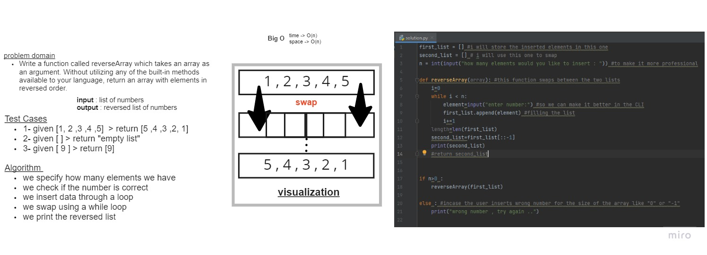

# Reverse an Array

Write a function called reverseArray which takes an array as an argument. Without utilizing any of the built-in methods available to your language, return an array with elements in reversed order.

## Whiteboard Process

## Approach & Efficiency
the BigO for this code is O(n) , for both Time and Space .
the loop takes the bigges piece of the cake with time and space .