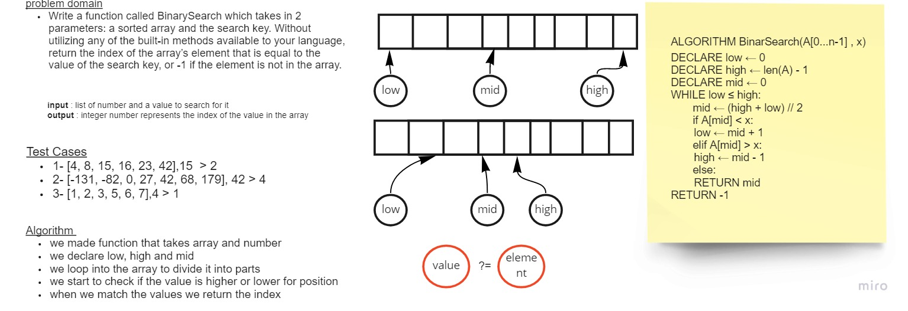

# Binary Search of Sorted Array

we made function that takes array and number
we declare low, high and mid
we loop into the array to divide it into parts
we start to check if the value is higher or lower for position
when we match the values we return the index

## Whiteboard Process

## Approach & Efficiency
Ive made sure we get the smallest Big(O) thats possible by using iteration and basic if statements